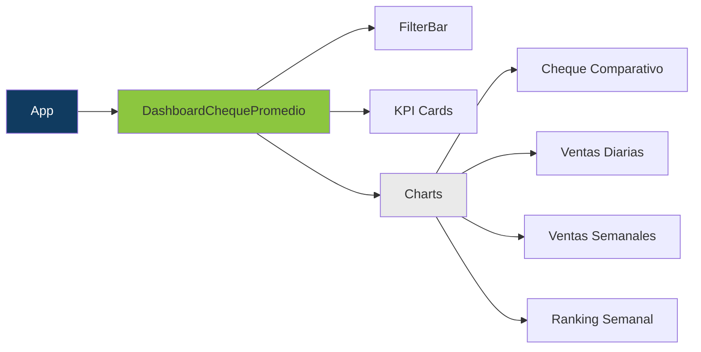

# Design Document

## Overview

El **Dashboard de Cheque Promedio** es un módulo analítico que se integra al sistema de Ventas de CoffeeSoft ERP. Proporciona visualizaciones interactivas de métricas clave relacionadas con el cheque promedio, ventas y clientes, permitiendo comparativas anuales y análisis por categorías.

El diseño sigue la arquitectura MVC de CoffeeSoft, separando la lógica en tres capas:
- **Frontend (JS)**: `kpi/marketing/ventas/src/js/dashboard-cheque-promedio.js`
- **Controlador (PHP)**: `kpi/marketing/ventas/ctrl/ctrl-dashboard-cheque-promedio.php`
- **Modelo (PHP)**: `kpi/marketing/ventas/mdl/mdl-dashboard-cheque-promedio.php`

## Architecture

### System Context

```mermaid
graph TB
    User[Usuario] --> UI[Dashboard UI]
    UI --> App[App Class]
    App --> DashboardCP[DashboardChequePromedio Class]
    DashboardCP --> API[ctrl-dashboard-cheque-promedio.php]
    API --> Model[mdl-dashboard-cheque-promedio.php]
    Model --> DB[(Base de Datos)]
    
    style UI fill:#8CC63F
    style API fill:#103B60
    style Model fill:#103B60
```



### Component Architecture



## Components and Interfaces

### Frontend Components

#### 1. DashboardChequePromedio Class

**Responsabilidad**: Gestionar la renderización y lógica del dashboard de cheque promedio.

**Métodos Principales**:

```javascript
class DashboardChequePromedio extends Templates {
    constructor(link, div_modulo)
    render()                          // Inicializa el layout y componentes
    layout()                          // Estructura HTML del dashboard
    renderDashboard()                 // Obtiene datos y renderiza componentes
    filterBarDashboard()              // Crea barra de filtros (UDN, mes, año)
    showCards(data)                   // Renderiza KPI cards
    renderCharts(mkt)                 // Renderiza todos los gráficos
    chequeComparativo(options)        // Gráfico de barras comparativo
    ventasPorDiaSemana(data)          // Gráfico de ventas semanales
    comparativaIngresosDiarios(opts)  // Gráfico lineal de tendencias
    topDiasSemana(options)            // Ranking de mejores días
    validateFilters()                 // Valida filtros antes de consultar
    showLoadingState()                // Muestra skeleton loader
    showError(message)                // Muestra mensajes de error
    handleCategoryChange(udn)         // Filtra categorías por UDN
}
```

**Integración con App**:
```javascript
// En App.layout()
{
    id: "dashboardChequePromedio",
    tab: "Dashboard Cheque Promedio",
    onClick: () => dashboardChequePromedio.renderDashboard()
}
```

#### 2. Componentes Reutilizables CoffeeSoft

| Componente | Uso | Parámetros Clave |
|------------|-----|------------------|
| `infoCard()` | KPI cards | `parent`, `theme`, `json` (array de cards) |
| `linearChart()` | Gráfico de líneas | `parent`, `id`, `title`, `data` (labels, datasets) |
| `barChart()` | Gráfico de barras | `parent`, `id`, `title`, `labels`, `dataA`, `dataB` |
| `createfilterBar()` | Barra de filtros | `parent`, `data` (array de inputs/selects) |
| `dashboardComponent()` | Layout del dashboard | `parent`, `id`, `title`, `subtitle`, `json` |

### Backend Components

#### 1. Controlador (ctrl-dashboard-cheque-promedio.php)

**Clase**: `ctrl extends mdl`

**Métodos**:

```php
class ctrl extends mdl {
    function init()                           // Inicializa filtros (UDN, categorías)
    function apiChequePromedioDashboard()     // Obtiene datos principales del dashboard
    function apiChequePromedioByCategory()    // Cheque promedio por categoría
    function apiVentasPorDiaSemana()          // Ventas agrupadas por día de semana
    function apiTopDiasMes()                  // Ranking de mejores días del mes
    function apiTopDiasSemanaPromedio()       // Promedio semanal por día
    function apiComparativaIngresosDiarios()  // Tendencias diarias comparativas
}
```

**Funciones Auxiliares**:
```php
function formatChequePromedio($valor)         // Formatea valores monetarios
function calculateVariacion($actual, $anterior) // Calcula % de variación
function getTendencia($variacion)             // Determina tendencia (positiva/negativa)
```

#### 2. Modelo (mdl-dashboard-cheque-promedio.php)

**Clase**: `mdl extends CRUD`

**Métodos**:

```php
class mdl extends CRUD {
    // Consultas principales
    function listChequePromedioDashboard($array)      // Datos KPI del dashboard
    function listChequePromedioByCategory($array)     // Cheque por categoría
    function listVentasPorDiaSemana($array)           // Ventas agrupadas por día
    function listTopDiasMes($array)                   // Top días del mes
    function listTopDiasSemanaPromedio($array)        // Promedio por día de semana
    function listIngresosDiariosComparativos($array)  // Ingresos diarios comparados
    
    // Consultas auxiliares
    function getVentasDia($array)                     // Ventas de un día específico
    function getVentasMes($array)                     // Ventas del mes
    function getClientesMes($array)                   // Total de clientes del mes
    function getChequePromedioMes($array)             // Cheque promedio del mes
    
    // Filtros
    function lsUDN()                                  // Lista de UDN disponibles
    function lsCategoriasByUDN($array)                // Categorías por UDN
}
```

## Data Models

### Request/Response Structures

#### 1. apiChequePromedioDashboard

**Request**:
```javascript
{
    opc: "apiChequePromedioDashboard",
    udn: 1,
    anio: 2025,
    mes: 10
}
```

**Response**:
```javascript
{
    status: 200,
    data: {
        ventaDia: "$ 15,234.50",
        ventaMes: "$ 456,789.00",
        Clientes: "1,234",
        ChequePromedio: "$ 370.25",
        variacionCheque: 8.5,
        tendencia: "positiva"
    }
}
```

#### 2. apiChequePromedioByCategory

**Request**:
```javascript
{
    opc: "apiChequePromedioByCategory",
    udn: 1,
    anio: 2025,
    mes: 10
}
```

**Response**:
```javascript
{
    status: 200,
    dataset: {
        labels: ["Hospedaje", "AyB", "Diversos"],
        A: [673.18, 613.0, 54.6],    // Año actual
        B: [640.25, 590.5, 49.75]    // Año anterior
    },
    anioA: 2025,
    anioB: 2024
}
```

#### 3. apiVentasPorDiaSemana

**Request**:
```javascript
{
    opc: "apiVentasPorDiaSemana",
    udn: 1,
    anio: 2025,
    mes: 10
}
```

**Response**:
```javascript
{
    status: 200,
    labels: ["Lunes", "Martes", "Miércoles", "Jueves", "Viernes", "Sábado", "Domingo"],
    dataA: [12500, 13200, 14100, 15300, 18900, 22400, 19800],  // 2025
    dataB: [11800, 12500, 13400, 14200, 17500, 21000, 18500],  // 2024
    yearA: 2025,
    yearB: 2024
}
```

### Database Schema

**Tabla Principal**: `softrestaurant_ventas` (ya existente)

```sql
CREATE TABLE softrestaurant_ventas (
    id_venta INT PRIMARY KEY AUTO_INCREMENT,
    udn INT NOT NULL,
    fecha DATE NOT NULL,
    noHabitaciones INT DEFAULT 0,
    Hospedaje DECIMAL(10,2) DEFAULT 0,
    AyB DECIMAL(10,2) DEFAULT 0,
    Diversos DECIMAL(10,2) DEFAULT 0,
    alimentos DECIMAL(10,2) DEFAULT 0,
    bebidas DECIMAL(10,2) DEFAULT 0,
    guarniciones DECIMAL(10,2) DEFAULT 0,
    sales DECIMAL(10,2) DEFAULT 0,
    domicilio DECIMAL(10,2) DEFAULT 0,
    date_creation TIMESTAMP DEFAULT CURRENT_TIMESTAMP,
    INDEX idx_udn_fecha (udn, fecha),
    INDEX idx_fecha (fecha)
);
```

**Consultas Clave**:

```sql
-- Cheque promedio del mes
SELECT 
    SUM(alimentos + bebidas) as total_ventas,
    SUM(noHabitaciones) as total_clientes,
    (SUM(alimentos + bebidas) / SUM(noHabitaciones)) as cheque_promedio
FROM softrestaurant_ventas
WHERE udn = ? AND YEAR(fecha) = ? AND MONTH(fecha) = ?;

-- Ventas por día de la semana
SELECT 
    DAYOFWEEK(fecha) as dia_semana,
    AVG(alimentos + bebidas) as promedio_ventas,
    COUNT(*) as ocurrencias
FROM softrestaurant_ventas
WHERE udn = ? AND YEAR(fecha) = ? AND MONTH(fecha) = ?
GROUP BY DAYOFWEEK(fecha)
ORDER BY dia_semana;

-- Top días del mes
SELECT 
    fecha,
    DAYNAME(fecha) as dia,
    noHabitaciones as clientes,
    (alimentos + bebidas) as total
FROM softrestaurant_ventas
WHERE udn = ? AND YEAR(fecha) = ? AND MONTH(fecha) = ?
ORDER BY total DESC
LIMIT 5;
```

## Error Handling

### Frontend Error Handling

```javascript
// Validación de filtros
validateFilters() {
    const udn = $('#filterBarDashboard #udn').val();
    const periodo1 = $('#filterBarDashboard #periodo1').val();
    
    if (!udn || !periodo1) {
        this.showError("Todos los filtros son requeridos");
        return false;
    }
    return true;
}

// Manejo de errores de API
try {
    let mkt = await useFetch({ url: api, data: {...} });
    
    if (!mkt || mkt.status === 500) {
        this.showError("Error al obtener datos del servidor");
        return;
    }
    
    this.renderCharts(mkt);
} catch (error) {
    console.error("Error en renderDashboard:", error);
    this.showError("Error al cargar el dashboard");
}
```

### Backend Error Handling

```php
function apiChequePromedioDashboard() {
    // Validaciones de entrada
    if (!isset($_POST['anio']) || !isset($_POST['mes']) || !isset($_POST['udn'])) {
        return [
            'status' => 400,
            'message' => 'Parámetros requeridos faltantes'
        ];
    }
    
    $anio = (int) $_POST['anio'];
    $mes = (int) $_POST['mes'];
    $udn = (int) $_POST['udn'];
    
    // Validar rangos
    if ($anio < 2020 || $anio > date('Y') + 1) {
        return ['status' => 400, 'message' => 'Año inválido'];
    }
    
    if ($mes < 1 || $mes > 12) {
        return ['status' => 400, 'message' => 'Mes inválido'];
    }
    
    if (!in_array($udn, [1, 2, 3, 4, 5])) {
        return ['status' => 400, 'message' => 'UDN inválida'];
    }
    
    try {
        $data = $this->listChequePromedioDashboard([$udn, $anio, $mes]);
        
        return [
            'status' => 200,
            'data' => $data
        ];
    } catch (Exception $e) {
        error_log("Error en apiChequePromedioDashboard: " . $e->getMessage());
        return [
            'status' => 500,
            'message' => 'Error interno del servidor'
        ];
    }
}
```

## Testing Strategy

### Unit Tests

**Frontend (JavaScript)**:
```javascript
// Test: Validación de filtros
describe('DashboardChequePromedio.validateFilters()', () => {
    it('debe retornar false si falta UDN', () => {
        $('#filterBarDashboard #udn').val('');
        expect(dashboardChequePromedio.validateFilters()).toBe(false);
    });
    
    it('debe retornar true si todos los filtros están completos', () => {
        $('#filterBarDashboard #udn').val('1');
        $('#filterBarDashboard #periodo1').val('2025-10');
        expect(dashboardChequePromedio.validateFilters()).toBe(true);
    });
});

// Test: Cálculo de tendencia
describe('DashboardChequePromedio.getChequePromedioTrend()', () => {
    it('debe mostrar tendencia positiva para variación > 5%', () => {
        const data = { variacionCheque: 8.5 };
        const trend = dashboardChequePromedio.getChequePromedioTrend(500, data);
        expect(trend).toContain('↗️');
    });
});
```

**Backend (PHP)**:
```php
// Test: Validación de parámetros
class CtrlDashboardChequePromedioTest extends PHPUnit\Framework\TestCase {
    public function testApiChequePromedioDashboard_MissingParams() {
        $_POST = ['opc' => 'apiChequePromedioDashboard'];
        $ctrl = new ctrl();
        $result = $ctrl->apiChequePromedioDashboard();
        
        $this->assertEquals(400, $result['status']);
        $this->assertStringContainsString('faltantes', $result['message']);
    }
    
    public function testApiChequePromedioDashboard_InvalidYear() {
        $_POST = ['opc' => 'apiChequePromedioDashboard', 'anio' => 2010, 'mes' => 10, 'udn' => 1];
        $ctrl = new ctrl();
        $result = $ctrl->apiChequePromedioDashboard();
        
        $this->assertEquals(400, $result['status']);
        $this->assertEquals('Año inválido', $result['message']);
    }
}
```

### Integration Tests

```javascript
// Test: Flujo completo de renderizado
describe('Dashboard Integration', () => {
    it('debe cargar y renderizar el dashboard completo', async () => {
        // Simular selección de filtros
        $('#filterBarDashboard #udn').val('1');
        $('#filterBarDashboard #periodo1').val('2025-10');
        
        // Ejecutar renderizado
        await dashboardChequePromedio.renderDashboard();
        
        // Verificar que se renderizaron los componentes
        expect($('#cardDashboard').children().length).toBeGreaterThan(0);
        expect($('#containerChequePro canvas').length).toBe(1);
        expect($('#barProductMargen canvas').length).toBe(1);
    });
});
```

### Performance Tests

```javascript
// Test: Tiempo de carga
describe('Performance', () => {
    it('debe cargar el dashboard en menos de 2 segundos', async () => {
        const startTime = performance.now();
        
        await dashboardChequePromedio.renderDashboard();
        
        const endTime = performance.now();
        const loadTime = endTime - startTime;
        
        expect(loadTime).toBeLessThan(2000);
    });
});
```

## Design Decisions

### 1. Arquitectura MVC
**Decisión**: Separar la lógica en tres capas (Frontend JS, Controlador PHP, Modelo PHP).

**Razón**: Mantener consistencia con la arquitectura existente de CoffeeSoft y facilitar el mantenimiento.

### 2. Componentes Reutilizables
**Decisión**: Usar componentes de la librería CoffeeSoft (`infoCard`, `linearChart`, `barChart`).

**Razón**: Reducir código duplicado y mantener consistencia visual en todo el sistema.

### 3. Validación en Frontend y Backend
**Decisión**: Implementar validaciones tanto en JavaScript como en PHP.

**Razón**: Mejorar UX con validaciones inmediatas y garantizar seguridad con validaciones del lado del servidor.

### 4. Caché de Consultas
**Decisión**: Implementar caché estático en el controlador para consultas frecuentes.

**Razón**: Reducir carga en la base de datos y mejorar tiempos de respuesta.

### 5. Loading States
**Decisión**: Mostrar skeleton loaders durante la carga de datos.

**Razón**: Mejorar la percepción de velocidad y proporcionar feedback visual al usuario.

### 6. Paleta de Colores Corporativa
**Decisión**: Usar colores CoffeeSoft (#103B60, #8CC63F, #EAEAEA).

**Razón**: Mantener identidad visual consistente con el resto del sistema.

## Visual Design

### Layout Structure

```
┌─────────────────────────────────────────────────────────────┐
│  Header: "📊 Dashboard de Cheque Promedio"                  │
├─────────────────────────────────────────────────────────────┤
│  FilterBar: [UDN] [Período 1] [Período 2] [Actualizar]     │
├─────────────────────────────────────────────────────────────┤
│  KPI Cards:                                                  │
│  ┌──────────┐ ┌──────────┐ ┌──────────┐ ┌──────────┐      │
│  │ Venta    │ │ Venta    │ │ Clientes │ │ Cheque   │      │
│  │ del Día  │ │ del Mes  │ │ del Mes  │ │ Promedio │      │
│  └──────────┘ └──────────┘ └──────────┘ └──────────┘      │
├─────────────────────────────────────────────────────────────┤
│  Charts Grid (2 columns):                                    │
│  ┌─────────────────────┐ ┌─────────────────────┐           │
│  │ Cheque Comparativo  │ │ Ventas Diarias      │           │
│  │ (Bar Chart)         │ │ (Line Chart)        │           │
│  └─────────────────────┘ └─────────────────────┘           │
│  ┌─────────────────────┐ ┌─────────────────────┐           │
│  │ Ventas Semanales    │ │ Ranking Semanal     │           │
│  │ (Bar Chart)         │ │ (List)              │           │
│  └─────────────────────┘ └─────────────────────┘           │
└─────────────────────────────────────────────────────────────┘
```

### Color Scheme

| Elemento | Color | Uso |
|----------|-------|-----|
| Primario | #103B60 | Títulos, botones principales, año actual |
| Secundario | #8CC63F | Indicadores positivos, año anterior |
| Fondo | #F9FAFB | Background del dashboard |
| Cards | #FFFFFF | Fondo de KPI cards y gráficos |
| Texto | #374151 | Texto principal |
| Texto Secundario | #6B7280 | Subtítulos y descripciones |
| Error | #DC2626 | Mensajes de error, tendencias negativas |
| Success | #16A34A | Mensajes de éxito, tendencias positivas |
